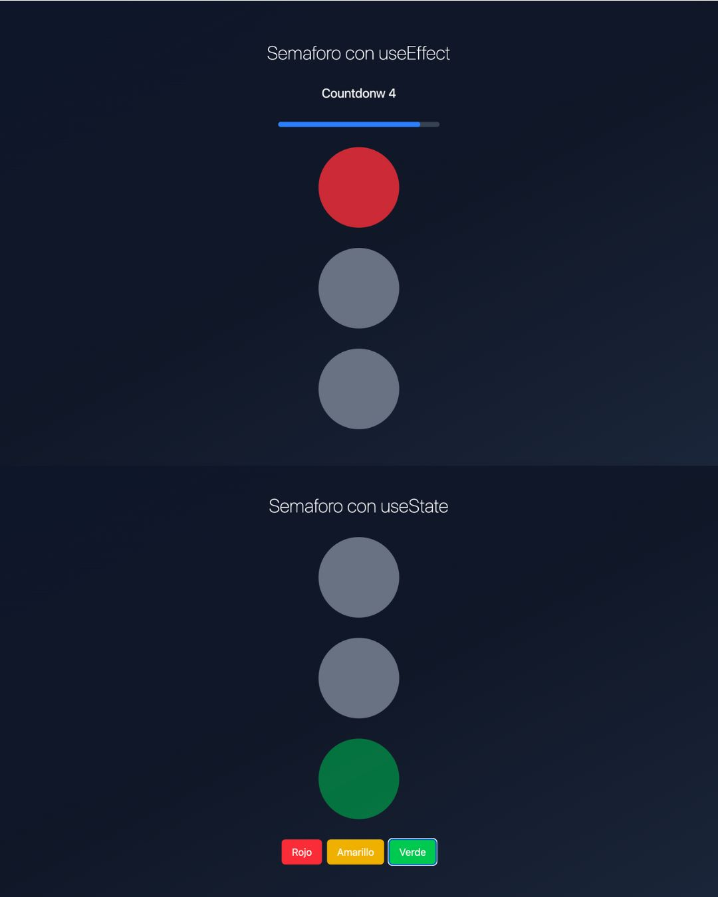

# Trafict light with React

[@anyelycastillo.es](https://anyelycastillo.es/)
[@instagram](https://www.instagram.com/arq.castilloaa/?hl=es)
[@linkedin](https://www.linkedin.com/in/anyely-castillo-duarte)

## About this Project

A semaphore designed to practice React and its different hooks, mainly useState and useEffect
### _If you leave me some constructive feedback or a star ⭐, I would appreciate it._  
```sh
> Click on the image !
```

[](https://trafficlight-app.netlify.app/)

## About me

I have +1 year of experience as a frontend developer, here you will find projects made with different tools and designs for an optimal user interface.

## Curriculum and Certificates

- https://padlet.com/anyelycastillo25/curr-culum-vitae-4s54c26zztjns9vb
- https://padlet.com/anyelycastillo25/t-tulos-acad-micos-certificados-9yfv6hofm7x6bcnt 
